## 用户手册

###### 3180101972_蔡灿宇 // Lluvia

#### 0. 目录

+ 项目简介
+ 功能介绍
+ 操作指南
+ 常见问题QA

#### 1. 项目简介

##### 1.1 项目背景

+ 物联网（ IoT ，Internet of things ）即“万物相连的互联网”，是互联网基础上的延伸和扩展的网络，将各种信息传感设备与网络结合起来而形成的一个巨大网络，实现在任何时间、任何地点，人、机、物的互联互通。
+ 本网站作为一个物联网应用网站，基于B/S结构设计，通过实现物联网的基本功能，实现指定物联网终端数据的接收与统计分析。

##### 1.2 运行环境

###### 1.2.1 软件环境

+ 详见**运行指南文档**

###### 1.2.2 硬件环境

+ CPU：主频大于2GHz
+ 硬盘:硬盘容量大于 200GB、硬盘转速大于等于 5400 转/分钟
+ 其他硬件满足正常的使用需求即可。

#### 2. 功能介绍

##### 2.1 功能模块设置

###### 2.1.1 未注册的游客

+ 用户登录模块
+ 首页展示模块

###### 2.1.2 用户

+ 用户管理模块
+ 统计展示模块
+ 设备管理模块
+ 信息展示模块

##### 2.2 具体功能

+ 能够对mqttServer发布的信息进行监听和保存
+ 提供用户管理功能，能注册登录进入系统，且进行一定的加密与验证处理
+ 用户可以查看并编辑、新建设备信息
+ 用户可以查看某个设备上报的数据信息
+ 用户可以对数据信息进行筛选，并查看设备的状态和历史轨迹
+ 用户可以通过图表形式直观查看设备、信息的统计情况

#### 3. 操作指南

##### 3.1 用户注册与登录

+ 进入主页后，点击图片或者右上角登录，进入登录、注册界面

  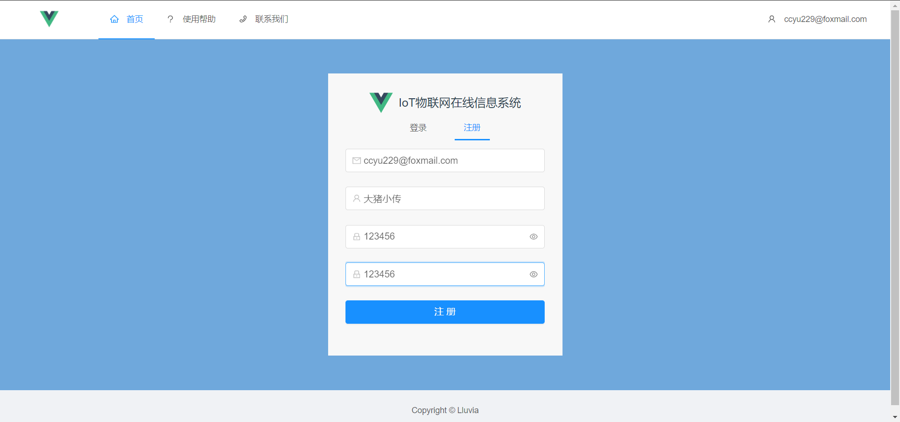 

  
图3-1-1用户注册

+ 点击注册成功后便可进行登录

  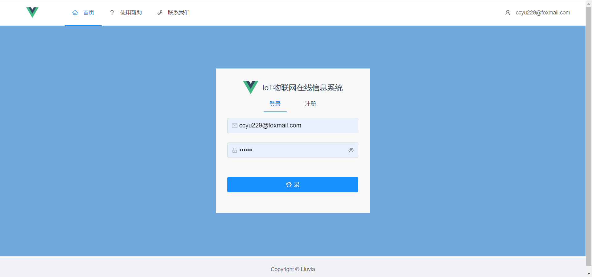 

  
图3-1-2用户登录

+ **当关掉该页面后，由于token存在60min，所以在60分钟内若再次点击登录，会自动根据token进行登录**

+ 登录后进入到个人中心界面

  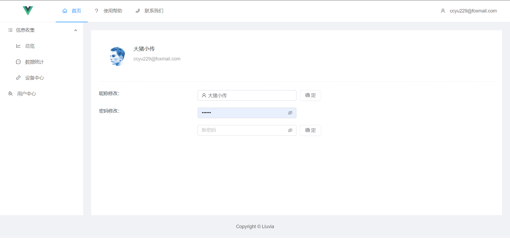 

  
图3-1-3 个人中心

+ **！但是如果点击登出，则不会保存token信息！**

##### 3.2 个人信息修改

+ 可以通过昵称修改修改姓名，不过姓名具有唯一性，所以如果已经被占用了就无法更改。

  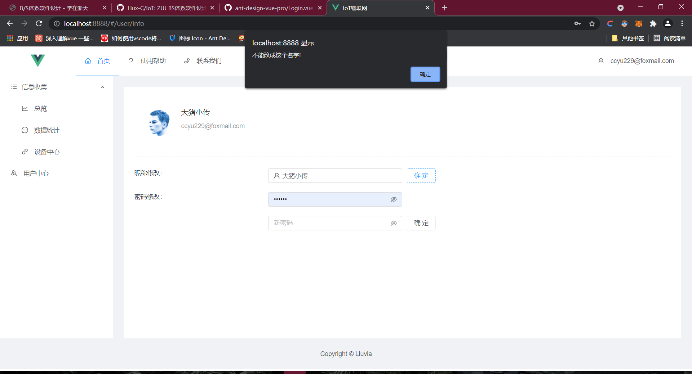 

  
图3-2-1 昵称修改失败

  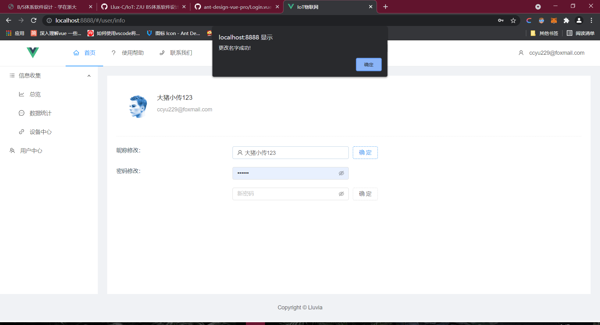 

  
图3-2-2 昵称修改成功

+ 可以通过密码修改来修改密码，**采用md5加密**，保证密码的不被泄露性

   

  
图3-2-3 密码修改成功

##### 3.3 设备信息编辑

+ 点击左侧导航栏“设备中心”，查看已有设备

  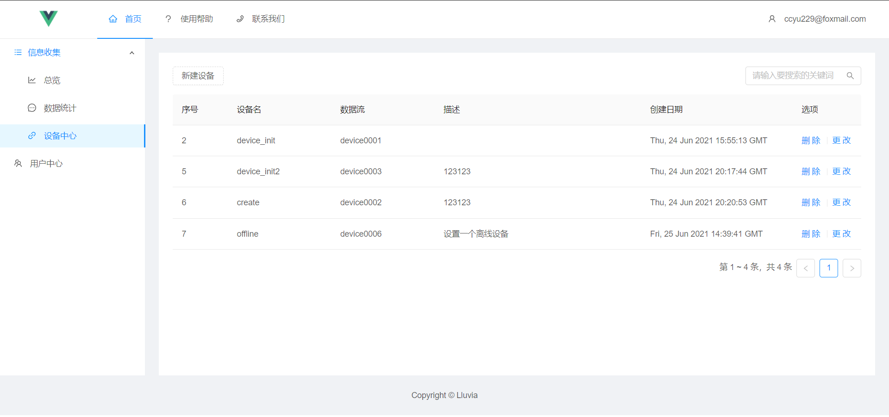 

  
图3-3-1 查看已有设备

+ 点击左上角新建设备，输入设备信息即可新建设备

  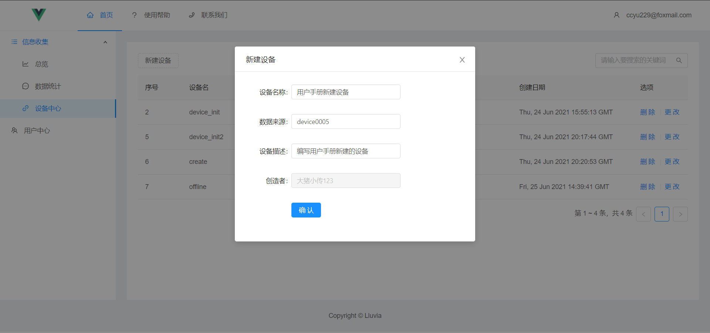 

  
图3-3-2 新建设备

  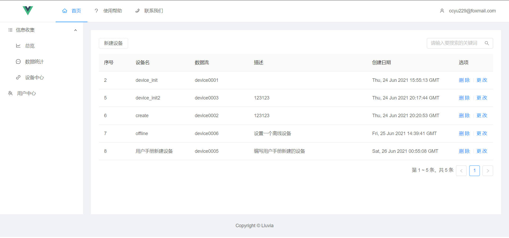 

  
图3-3-3 新建设备成功

+ 点击设备右侧的更改按钮，进行设备信息的更改

  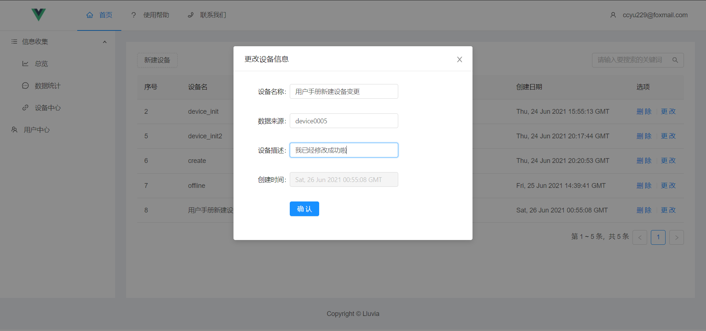 

  
图3-3-4 设备编辑

  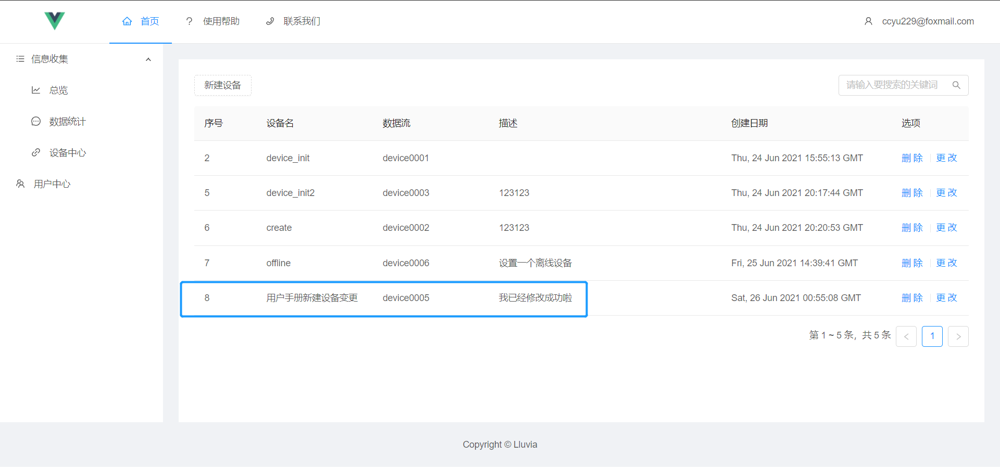 

  
图3-3-5 设备编辑成功

+ 点击设备右侧的删除按钮即可删除设备

   

  
图3-3-6 设备删除

  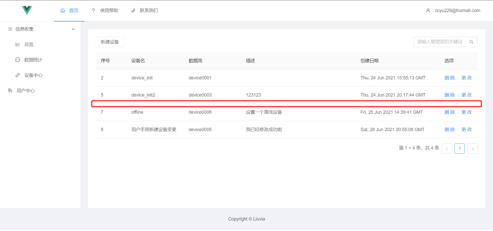  

  
图3-3-7 设备删除成功

+ 还可以在右上角输入关键字，筛选出对应想要的设备

  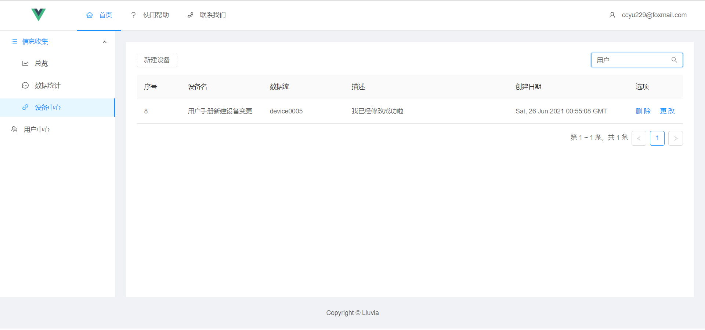 

  
图3-3-8 设备搜索

##### 3.4 消息数据统计

+ 点击数据统计，选择对应的设备即可查看该设备的数据，此时也可以对正常消息和**警告消息进行区分**

  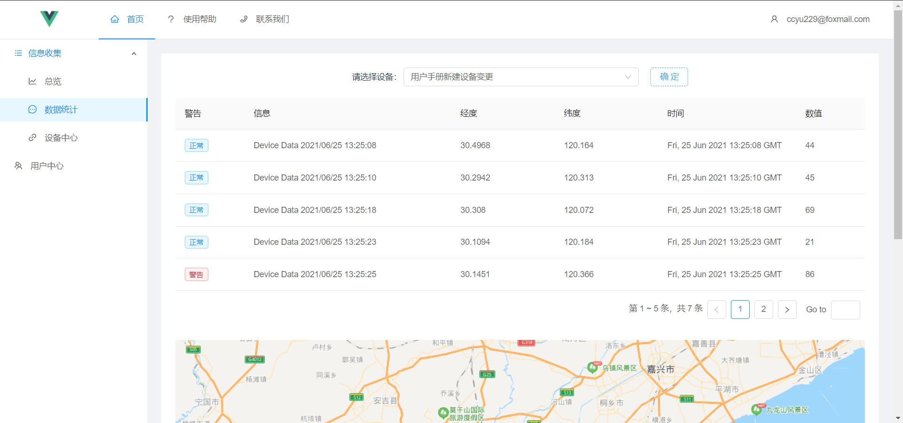 

  
图3-4-1 数据查看

+ 把y轴往下拉能看到地图，已经表明了该设备的历史轨迹

  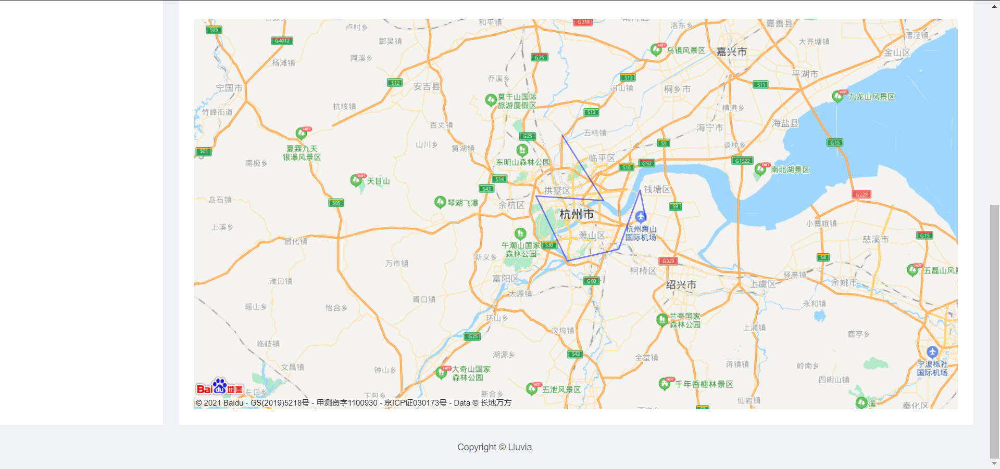 

  
图3-4-2 历史轨迹

##### 3.5 图表总览

+ 点击左侧总览，可以看到**设备在线情况**，**过去七天设备新建情况**，**过去七天消息接受情况**，这三个图表，分别是饼状图，柱状图和折线图

  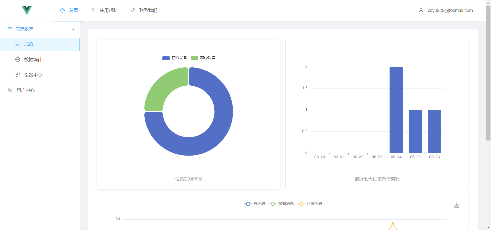 

  
图3-5-1 图标总览

#### 4. 常见问题QA

##### Q：为什么一段时间后点击任何功能都没反应？

+ 因为token存在的时间只有60min，所以一旦token失效，则无法再进行任何操作，所以这种情况下应该登出后重新登陆。

##### Q：为什么目前只有device0001~device0005的数据流，我可以设置其他数据流吗？

+ 因为目前的mqttClient只发送5个并发消息，所以只有这5个数据流，设置成其他数据流的话将会被变成**离线状态**，没有办法接受到任何消息。